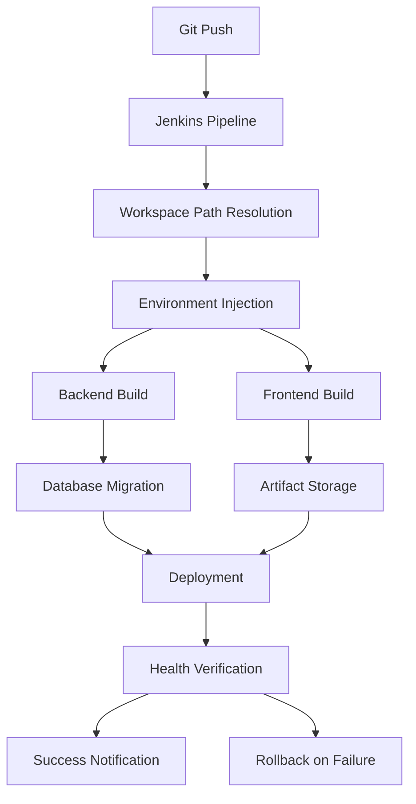
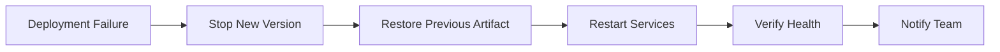

# Jenkins Pipeline Alignment Design

## Overview

This design document outlines the technical architecture and implementation approach for aligning the FarmTally Jenkins CI/CD pipeline with the current repository structure, implementing secure configuration management, database migration automation, comprehensive health checks, and proper artifact management.

## Architecture

### Current State Analysis

**Repository Structure:**
```
FarmTally/
├── package.json                 # Backend root
├── src/                        # Backend source
├── dist/                       # Backend build output
├── prisma/                     # Database schema
├── farmtally-frontend/         # Frontend directory
│   ├── package.json
│   ├── src/
│   └── .next/                  # Frontend build output
└── Jenkinsfile                 # Current pipeline
```

**Pipeline Issues:**
- Jenkinsfile references non-existent `backend/` and `frontend/` directories
- Environment variables hardcoded or missing
- No database migration integration
- Limited health checks (only `/health`)
- Frontend builds with development API URLs

### Target Architecture



## Components and Interfaces

### 1. Pipeline Configuration Manager

**Purpose:** Manages workspace paths and environment variable injection

**Interface:**
```groovy
// Jenkinsfile structure
pipeline {
    agent any
    
    environment {
        // Injected from Jenkins credentials
        DATABASE_URL = credentials('farmtally-database-url')
        JWT_SECRET = credentials('farmtally-jwt-secret')
        NEXT_PUBLIC_API_URL = credentials('farmtally-api-url')
    }
    
    stages {
        stage('Backend Build') {
            steps {
                // Execute from repository root
                sh 'npm ci'
                sh 'npm run build'
            }
        }
        
        stage('Frontend Build') {
            steps {
                dir('farmtally-frontend') {
                    sh 'npm ci'
                    sh 'npm run build'
                }
            }
        }
    }
}
```

**Key Features:**
- Dynamic workspace path resolution
- Secure credential injection
- Environment-specific configuration

### 2. Database Migration Handler

**Purpose:** Automates Prisma migrations during deployment

**Interface:**
```bash
#!/bin/bash
# migration-handler.sh

set -e

echo "Starting database migration..."

# Verify database connectivity
if ! npx prisma db pull --preview-feature; then
    echo "ERROR: Cannot connect to database"
    exit 1
fi

# Run migrations
echo "Applying migrations..."
npx prisma migrate deploy

# Verify migration success
if [ $? -eq 0 ]; then
    echo "Migrations completed successfully"
else
    echo "ERROR: Migration failed"
    exit 1
fi
```

**Key Features:**
- Pre-migration connectivity check
- Transactional migration execution
- Failure handling and rollback

### 3. Health Check System

**Purpose:** Comprehensive post-deployment verification

**Interface:**
```javascript
// health-check.js
const axios = require('axios');

class HealthChecker {
    constructor(baseUrl, serviceToken) {
        this.baseUrl = baseUrl;
        this.serviceToken = serviceToken;
    }

    async checkHealth() {
        const checks = [
            this.checkBasicHealth(),
            this.checkAuthEndpoint(),
            this.checkDatabaseConnectivity()
        ];

        const results = await Promise.allSettled(checks);
        return this.evaluateResults(results);
    }

    async checkBasicHealth() {
        const response = await axios.get(`${this.baseUrl}/api/health`);
        return { endpoint: '/api/health', status: response.status };
    }

    async checkAuthEndpoint() {
        const response = await axios.get(`${this.baseUrl}/api/auth/verify`, {
            headers: { Authorization: `Bearer ${this.serviceToken}` }
        });
        return { endpoint: '/api/auth/verify', status: response.status };
    }

    async checkDatabaseConnectivity() {
        const response = await axios.get(`${this.baseUrl}/api/farmers`, {
            headers: { Authorization: `Bearer ${this.serviceToken}` }
        });
        return { endpoint: '/api/farmers', status: response.status };
    }
}
```

**Key Features:**
- Multiple endpoint verification
- Authentication testing
- Database connectivity validation
- Detailed logging and reporting

### 4. Artifact Management System

**Purpose:** Version and store build artifacts with rollback capability

**Interface:**
```bash
#!/bin/bash
# artifact-manager.sh

COMMIT_SHA=$(git rev-parse HEAD)
BUILD_NUMBER=${BUILD_NUMBER:-$(date +%s)}
ARTIFACT_NAME="farmtally-${BUILD_NUMBER}-${COMMIT_SHA:0:8}"

create_artifact() {
    echo "Creating artifact: $ARTIFACT_NAME"
    
    # Create artifact directory
    mkdir -p artifacts/$ARTIFACT_NAME
    
    # Package backend
    tar -czf artifacts/$ARTIFACT_NAME/backend.tar.gz dist/
    
    # Package frontend
    tar -czf artifacts/$ARTIFACT_NAME/frontend.tar.gz -C farmtally-frontend .next/ public/
    
    # Create manifest
    cat > artifacts/$ARTIFACT_NAME/manifest.json << EOF
{
    "version": "$ARTIFACT_NAME",
    "commit": "$COMMIT_SHA",
    "buildNumber": "$BUILD_NUMBER",
    "timestamp": "$(date -u +%Y-%m-%dT%H:%M:%SZ)",
    "components": {
        "backend": "backend.tar.gz",
        "frontend": "frontend.tar.gz"
    }
}
EOF
    
    echo "Artifact created successfully"
}
```

**Key Features:**
- Git commit and build number tagging
- Component packaging
- Manifest generation
- Rollback support

### 5. Environment Configuration Manager

**Purpose:** Secure injection of environment-specific configuration

**Configuration Schema:**
```yaml
# environments/production.yml
database:
  url: "${DATABASE_URL}"
  
security:
  jwtSecret: "${JWT_SECRET}"
  corsOrigin: "${CORS_ORIGIN}"
  
email:
  host: "${SMTP_HOST}"
  user: "${SMTP_USER}"
  password: "${SMTP_PASSWORD}"
  
frontend:
  apiUrl: "${NEXT_PUBLIC_API_URL}"
  supabaseUrl: "${NEXT_PUBLIC_SUPABASE_URL}"
  supabaseKey: "${NEXT_PUBLIC_SUPABASE_ANON_KEY}"
```

**Key Features:**
- Environment-specific configuration
- Secure credential management
- Validation and error handling

## Data Models

### Pipeline State Model

```typescript
interface PipelineState {
    buildNumber: number;
    commitSha: string;
    stage: PipelineStage;
    status: PipelineStatus;
    artifacts: ArtifactInfo[];
    healthChecks: HealthCheckResult[];
    rollbackInfo?: RollbackInfo;
}

enum PipelineStage {
    WORKSPACE_SETUP = 'workspace_setup',
    ENVIRONMENT_INJECTION = 'environment_injection',
    BACKEND_BUILD = 'backend_build',
    FRONTEND_BUILD = 'frontend_build',
    DATABASE_MIGRATION = 'database_migration',
    DEPLOYMENT = 'deployment',
    HEALTH_VERIFICATION = 'health_verification',
    ARTIFACT_STORAGE = 'artifact_storage'
}

enum PipelineStatus {
    PENDING = 'pending',
    RUNNING = 'running',
    SUCCESS = 'success',
    FAILED = 'failed',
    ROLLED_BACK = 'rolled_back'
}
```

### Artifact Model

```typescript
interface ArtifactInfo {
    name: string;
    version: string;
    commitSha: string;
    buildNumber: number;
    timestamp: Date;
    components: ComponentInfo[];
    manifest: ArtifactManifest;
}

interface ComponentInfo {
    name: string;
    type: 'backend' | 'frontend';
    path: string;
    size: number;
    checksum: string;
}
```

## Error Handling

### Failure Scenarios and Responses

1. **Workspace Path Errors**
   - Detection: File/directory not found errors
   - Response: Immediate pipeline failure with path correction guidance
   - Recovery: Manual Jenkinsfile correction

2. **Environment Variable Missing**
   - Detection: Pre-build validation checks
   - Response: Pipeline failure with specific variable name
   - Recovery: Add missing credential to Jenkins

3. **Database Migration Failure**
   - Detection: Non-zero exit code from Prisma CLI
   - Response: Abort deployment, maintain previous version
   - Recovery: Manual database state verification and migration fix

4. **Health Check Failure**
   - Detection: Non-200 HTTP responses or timeouts
   - Response: Automatic rollback to previous version
   - Recovery: Investigate and fix underlying issue

5. **Build Artifact Corruption**
   - Detection: Checksum validation failure
   - Response: Rebuild from source
   - Recovery: Clean workspace and retry build

### Rollback Strategy



**Rollback Process:**
1. Immediately stop the failing deployment
2. Identify the last successful artifact version
3. Deploy the previous version using stored artifacts
4. Restart all services (PM2, Nginx)
5. Run health checks to verify rollback success
6. Send notifications with rollback details

## Testing Strategy

### Unit Testing
- Pipeline script validation
- Environment variable injection testing
- Artifact creation and validation
- Health check logic verification

### Integration Testing
- End-to-end pipeline execution in staging
- Database migration testing with sample data
- Multi-environment configuration validation
- Rollback procedure testing

### Staging Environment Testing
- Full pipeline execution with production-like data
- Performance testing of health checks
- Artifact storage and retrieval testing
- Failure scenario simulation

### Production Validation
- Smoke tests after each deployment
- Monitoring integration verification
- Alert system testing
- Documentation accuracy validation

## Security Considerations

### Credential Management
- All sensitive values stored in Jenkins credentials
- Automatic masking in pipeline logs
- Rotation procedures documented
- Access control and audit logging

### Network Security
- VPS access via SSH keys only
- Database connections over SSL
- API endpoints protected with authentication
- CORS configuration properly set

### Artifact Security
- Artifact integrity verification with checksums
- Secure storage with access controls
- Audit trail for all artifact operations
- Encryption for sensitive components

## Performance Considerations

### Build Optimization
- Parallel execution of independent stages
- Caching of npm dependencies
- Incremental builds where possible
- Resource allocation optimization

### Deployment Speed
- Minimal downtime deployment strategy
- Health check timeout optimization
- Artifact compression for faster transfers
- Database migration performance monitoring

### Monitoring and Alerting
- Pipeline execution time tracking
- Resource usage monitoring
- Failure rate analysis
- Performance trend reporting

This design provides a comprehensive foundation for implementing the Jenkins pipeline alignment requirements while ensuring security, reliability, and maintainability.