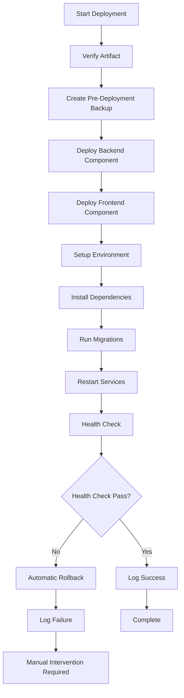
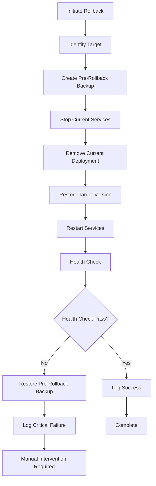

# FarmTally Artifact Deployment and Rollback Guide

## Overview

This guide covers the comprehensive artifact deployment and rollback system for FarmTally, including versioned artifact management, automated deployment procedures, and reliable rollback capabilities.

## System Architecture

### Components Overview

```
┌─────────────────────────────────────────────────────────────────┐
│                    Artifact Management System                    │
├─────────────────────────────────────────────────────────────────┤
│  ┌─────────────────┐  ┌─────────────────┐  ┌─────────────────┐  │
│  │   Artifact      │  │   Deployment    │  │    Rollback     │  │
│  │   Creation      │  │    System       │  │    System       │  │
│  │                 │  │                 │  │                 │  │
│  │ • Versioning    │  │ • Validation    │  │ • Backup        │  │
│  │ • Packaging     │  │ • Extraction    │  │ • Restoration   │  │
│  │ • Validation    │  │ • Health Check  │  │ • Verification  │  │
│  │ • Storage       │  │ • Logging       │  │ • Logging       │  │
│  └─────────────────┘  └─────────────────┘  └─────────────────┘  │
└─────────────────────────────────────────────────────────────────┘
```

### File Structure

```
farmtally/
├── artifacts/                          # Versioned artifacts storage
│   └── farmtally-v{build}-{commit}/
│       ├── backend/
│       │   ├── backend.tar.gz
│       │   └── backend.sha256
│       ├── frontend/
│       │   ├── frontend.tar.gz
│       │   └── frontend.sha256
│       ├── manifest.json
│       └── ARTIFACT_INFO.txt
├── deployment-backups/                 # Deployment backups
│   └── backup-{timestamp}-{user}/
│       ├── current-deployment.tar.gz
│       └── backup-info.json
├── deployment-logs/                    # Deployment logs
│   └── deployment-{date}.log
└── scripts/
    ├── artifact-manager.sh             # Artifact management
    ├── artifact-manager.ps1            # Windows version
    ├── artifact-deployer.sh            # Deployment system
    ├── artifact-deployer.ps1           # Windows version
    ├── jenkins-artifact-integration.groovy
    └── jenkins-rollback-job.groovy
```

## Artifact Management

### Artifact Creation Process

1. **Build Verification**
   - Verify backend build exists (`dist/` directory)
   - Verify frontend build exists (`farmtally-frontend/.next/` directory)
   - Validate build completeness

2. **Version Generation**
   - Format: `v{BUILD_NUMBER}-{COMMIT_SHORT}`
   - Example: `v1234-abc12345`
   - Include Git metadata (commit, branch, dirty flag)

3. **Component Packaging**
   - Backend: `dist/`, `package.json`, `package-lock.json`, `prisma/`
   - Frontend: `.next/`, `public/`, `package.json`, `next.config.ts`
   - Generate SHA256 checksums for integrity verification

4. **Manifest Creation**
   - Complete artifact metadata
   - Component information and checksums
   - Build environment details
   - Git repository information

### Artifact Storage

#### Directory Structure
```
artifacts/farmtally-v1234-abc12345/
├── backend/
│   ├── backend.tar.gz          # Backend package
│   └── backend.sha256          # Checksum file
├── frontend/
│   ├── frontend.tar.gz         # Frontend package
│   └── frontend.sha256         # Checksum file
├── metadata/                   # Additional metadata
├── manifest.json               # Complete artifact manifest
└── ARTIFACT_INFO.txt          # Human-readable summary
```

#### Retention Policy
- **Default retention**: 30 days
- **Maximum artifacts**: 50 versions
- **Cleanup strategy**: Remove oldest when limits exceeded
- **Configurable**: Via environment variables or script parameters

### Artifact Verification

#### Integrity Checks
- SHA256 checksum verification for all packages
- Manifest JSON validation
- Component completeness verification
- Size validation

#### Usage
```bash
# Verify specific artifact
./scripts/artifact-manager.sh verify farmtally-v1234-abc12345

# Windows
.\scripts\artifact-manager.ps1 verify -ArtifactName farmtally-v1234-abc12345
```

## Deployment System

### Deployment Process Flow



### Deployment Components

#### 1. Artifact Validation
- Verify artifact exists and is accessible
- Check artifact integrity (checksums)
- Validate manifest completeness

#### 2. Backup Creation
- Create timestamped backup of current deployment
- Include metadata (source, timestamp, creator)
- Store in `deployment-backups/` directory

#### 3. Component Deployment
- Extract backend package to deployment directory
- Extract frontend package to appropriate location
- Set proper file permissions
- Handle both local and remote deployments

#### 4. Environment Setup
- Install production dependencies (`npm ci --only=production`)
- Run database migrations (`npx prisma migrate deploy`)
- Configure environment variables

#### 5. Service Management
- Restart application services (PM2, systemd)
- Handle service startup failures
- Verify service status

#### 6. Health Verification
- Test `/api/health` endpoint
- Verify authenticated endpoints
- Check database connectivity
- Configurable timeout and retry logic

### Deployment Usage

#### Command Line
```bash
# Deploy specific artifact
./scripts/artifact-deployer.sh deploy farmtally-v1234-abc12345

# Deploy to remote server
./scripts/artifact-deployer.sh deploy farmtally-v1234-abc12345 production-server /opt/farmtally

# Windows
.\scripts\artifact-deployer.ps1 deploy -ArtifactName farmtally-v1234-abc12345
```

#### Jenkins Integration
```groovy
// In Jenkinsfile
def artifactManager = load 'scripts/jenkins-artifact-integration.groovy'
artifactManager.deployArtifact(
    env.ARTIFACT_NAME,
    'production-server',
    '/opt/farmtally'
)
```

## Rollback System

### Rollback Types

#### 1. Previous Artifact Rollback
- Automatically identifies the previous artifact version
- Deploys the most recent previous artifact
- Maintains artifact versioning consistency

#### 2. Specific Artifact Rollback
- Deploy a specific artifact version
- Useful for targeted rollbacks to known good versions
- Requires artifact name specification

#### 3. Backup Restoration
- Restore from deployment backup
- Useful when artifacts are corrupted or unavailable
- Restores exact previous state

### Rollback Process



### Rollback Safety Features

#### 1. Pre-Rollback Backup
- Always create backup before rollback
- Enables recovery if rollback fails
- Timestamped and user-tagged

#### 2. Health Verification
- Comprehensive health checks after rollback
- Automatic restoration if health checks fail
- Configurable health check parameters

#### 3. Failure Recovery
- Automatic restoration of pre-rollback state on failure
- Detailed logging of all rollback operations
- Alert notifications for critical failures

### Rollback Usage

#### Command Line
```bash
# Rollback to previous artifact
./scripts/artifact-deployer.sh rollback

# Rollback to specific backup
./scripts/artifact-deployer.sh rollback localhost /opt/farmtally backup-20240115-143022-jenkins

# Windows
.\scripts\artifact-deployer.ps1 rollback -BackupName backup-20240115-143022-jenkins
```

#### Jenkins Rollback Job
The system includes a comprehensive Jenkins rollback job with:
- Parameter-driven rollback options
- Pre-rollback health checks
- Approval workflows for healthy deployments
- Automatic backup creation
- Post-rollback verification
- Notification integration

### Jenkins Rollback Job Parameters

| Parameter | Description | Options |
|-----------|-------------|---------|
| `ROLLBACK_TYPE` | Type of rollback | `PREVIOUS_ARTIFACT`, `SPECIFIC_ARTIFACT`, `BACKUP_RESTORE` |
| `ARTIFACT_NAME` | Specific artifact (if applicable) | Artifact name |
| `BACKUP_NAME` | Backup name (if applicable) | Backup directory name |
| `TARGET_ENVIRONMENT` | Target environment | `production`, `staging`, `development` |
| `SKIP_HEALTH_CHECK` | Skip post-rollback health check | Boolean |
| `FORCE_ROLLBACK` | Force rollback without confirmation | Boolean |

## Logging and Monitoring

### Deployment Logs

#### Log Format
```json
{
  "timestamp": "2024-01-15T10:30:00Z",
  "action": "deploy",
  "artifact": "farmtally-v1234-abc12345",
  "target": "production-server:/opt/farmtally",
  "status": "success",
  "details": "Deployment completed successfully",
  "buildNumber": "1234",
  "buildUrl": "https://jenkins.example.com/job/farmtally/1234/",
  "user": "jenkins",
  "host": "build-server"
}
```

#### Log Management
- Daily log files: `deployment-{YYYYMMDD}.log`
- Automatic log rotation
- Structured JSON format for parsing
- Integration with monitoring systems

### Monitoring Integration

#### Health Check Endpoints
- `/api/health` - Basic application health
- `/api/auth/verify` - Authentication system health
- `/api/farmers` - Database connectivity verification

#### Metrics Collection
- Deployment success/failure rates
- Rollback frequency and causes
- Health check response times
- Artifact creation and storage metrics

## Security Considerations

### Access Control
- SSH key-based authentication for remote deployments
- Jenkins credential management for sensitive data
- File permission management during deployment
- Audit logging for all operations

### Data Protection
- Encrypted artifact storage (optional)
- Secure credential injection
- Environment variable masking in logs
- Backup encryption capabilities

### Network Security
- SSH-only remote access
- VPN requirements for production deployments
- Firewall configuration for deployment ports
- SSL/TLS for all API communications

## Troubleshooting

### Common Issues

#### Artifact Creation Failures
```
ERROR: Backend build directory 'dist' not found
```
**Solution**: Ensure `npm run build` completes successfully before artifact creation

#### Deployment Failures
```
ERROR: Failed to extract backend package
```
**Solutions**:
- Check disk space on target server
- Verify file permissions
- Check network connectivity
- Validate artifact integrity

#### Health Check Failures
```
ERROR: Health check failed after 30 attempts
```
**Solutions**:
- Check service logs for startup errors
- Verify database connectivity
- Check environment variable configuration
- Validate port availability

#### Rollback Failures
```
ERROR: Backup file not found for rollback
```
**Solutions**:
- Check backup directory permissions
- Verify backup creation process
- Use artifact rollback instead of backup restoration
- Manual deployment restoration

### Debug Mode

#### Enable Verbose Logging
```bash
export DEBUG=1
export VERBOSE=1
./scripts/artifact-deployer.sh deploy farmtally-v1234-abc12345
```

#### Log Analysis
```bash
# View recent deployment logs
./scripts/artifact-deployer.sh logs

# View specific date logs
./scripts/artifact-deployer.sh logs 20240115

# Windows
.\scripts\artifact-deployer.ps1 logs -DateFilter 20240115
```

### Recovery Procedures

#### Complete System Recovery
1. Identify last known good artifact
2. Stop all services
3. Clear deployment directory
4. Deploy known good artifact
5. Verify system health
6. Update monitoring systems

#### Database Recovery
1. Stop application services
2. Restore database from backup
3. Run migration rollback if needed
4. Deploy compatible artifact version
5. Verify data integrity

## Best Practices

### Development Workflow
1. **Always test locally** before creating artifacts
2. **Run full test suite** before artifact creation
3. **Verify migrations** in staging environment
4. **Create artifacts** only from clean Git state
5. **Document changes** in commit messages

### Deployment Practices
1. **Deploy during maintenance windows** for production
2. **Monitor health checks** during and after deployment
3. **Keep rollback procedures** readily available
4. **Test rollback procedures** regularly in staging
5. **Maintain deployment documentation** up to date

### Monitoring and Alerting
1. **Set up alerts** for deployment failures
2. **Monitor artifact storage** usage
3. **Track deployment metrics** over time
4. **Review logs regularly** for patterns
5. **Test alert systems** periodically

### Security Practices
1. **Rotate SSH keys** regularly
2. **Audit access logs** monthly
3. **Encrypt sensitive backups**
4. **Use least privilege** access
5. **Monitor for unauthorized** access

## Integration with CI/CD

### Jenkins Pipeline Integration
The artifact management system is fully integrated with the Jenkins pipeline:

1. **Automatic artifact creation** after successful builds
2. **Artifact verification** before deployment
3. **Deployment logging** with artifact traceability
4. **Automatic rollback** on deployment failure
5. **Retention policy enforcement**

### Pipeline Stages
```groovy
stage('Create Build Artifact') {
    // Artifact creation and verification
}

stage('Deploy Artifact to VPS') {
    // Artifact deployment with rollback capability
}

post {
    failure {
        // Automatic rollback on pipeline failure
    }
}
```

### Notification Integration
- Slack notifications for deployment events
- Email alerts for critical failures
- Build status updates with artifact information
- Rollback notifications with approval tracking

## Maintenance

### Regular Maintenance Tasks

#### Weekly
- Review deployment logs for errors
- Check artifact storage usage
- Verify backup integrity
- Test health check endpoints

#### Monthly
- Clean old artifacts beyond retention policy
- Review and rotate access credentials
- Update deployment documentation
- Test rollback procedures in staging

#### Quarterly
- Review and update retention policies
- Audit security configurations
- Performance review of deployment times
- Update disaster recovery procedures

### Capacity Planning
- Monitor artifact storage growth
- Plan for increased deployment frequency
- Scale backup storage as needed
- Review network bandwidth requirements

This comprehensive guide provides all necessary information for managing the FarmTally artifact deployment and rollback system effectively and securely.