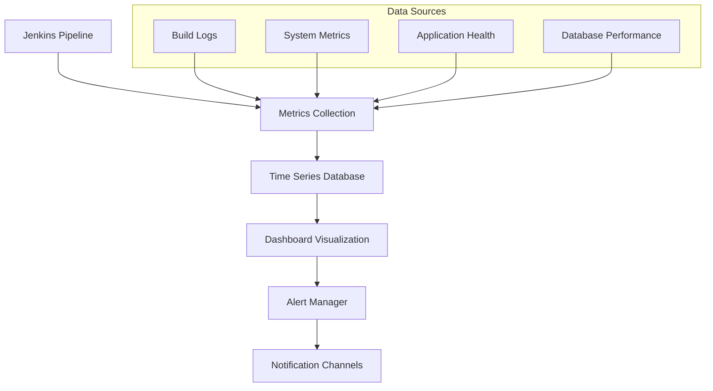

# Pipeline Monitoring Dashboard Setup

## Overview

This document provides instructions for setting up comprehensive monitoring dashboards for the FarmTally Jenkins CI/CD pipeline. The monitoring system tracks build performance, deployment success rates, system health, and provides real-time alerts for issues.

## Monitoring Architecture

### Components Overview



### Technology Stack

- **Metrics Collection**: Prometheus + Jenkins Prometheus Plugin
- **Time Series Database**: Prometheus
- **Visualization**: Grafana
- **Alerting**: Alertmanager
- **Log Aggregation**: ELK Stack (Elasticsearch, Logstash, Kibana)

## Prometheus Setup

### Installation

```bash
# Create prometheus user
sudo useradd --no-create-home --shell /bin/false prometheus

# Create directories
sudo mkdir /etc/prometheus
sudo mkdir /var/lib/prometheus
sudo chown prometheus:prometheus /etc/prometheus
sudo chown prometheus:prometheus /var/lib/prometheus

# Download and install Prometheus
cd /tmp
wget https://github.com/prometheus/prometheus/releases/download/v2.40.0/prometheus-2.40.0.linux-amd64.tar.gz
tar xvf prometheus-2.40.0.linux-amd64.tar.gz
sudo cp prometheus-2.40.0.linux-amd64/prometheus /usr/local/bin/
sudo cp prometheus-2.40.0.linux-amd64/promtool /usr/local/bin/
sudo chown prometheus:prometheus /usr/local/bin/prometheus
sudo chown prometheus:prometheus /usr/local/bin/promtool
```

### Configuration

Create `/etc/prometheus/prometheus.yml`:

```yaml
global:
  scrape_interval: 15s
  evaluation_interval: 15s

rule_files:
  - "jenkins_rules.yml"
  - "application_rules.yml"

alerting:
  alertmanagers:
    - static_configs:
        - targets:
          - localhost:9093

scrape_configs:
  # Jenkins metrics
  - job_name: 'jenkins'
    static_configs:
      - targets: ['localhost:8080']
    metrics_path: '/prometheus'
    scrape_interval: 30s

  # Application health metrics
  - job_name: 'farmtally-api'
    static_configs:
      - targets: ['localhost:3000']
    metrics_path: '/api/metrics'
    scrape_interval: 30s

  # System metrics
  - job_name: 'node-exporter'
    static_configs:
      - targets: ['localhost:9100']

  # Database metrics
  - job_name: 'postgres-exporter'
    static_configs:
      - targets: ['localhost:9187']
```

### Jenkins Prometheus Plugin Configuration

1. **Install Plugin**
   ```
   1. Navigate to Jenkins → Manage Jenkins → Manage Plugins
   2. Search for "Prometheus metrics plugin"
   3. Install and restart Jenkins
   ```

2. **Configure Metrics Endpoint**
   ```
   1. Go to Manage Jenkins → Configure System
   2. Find "Prometheus" section
   3. Enable "Collect metrics for all builds"
   4. Set path to "/prometheus" (default)
   5. Save configuration
   ```

3. **Verify Metrics Collection**
   ```bash
   # Test metrics endpoint
   curl http://localhost:8080/prometheus
   
   # Should return metrics like:
   # jenkins_builds_duration_milliseconds_summary
   # jenkins_builds_success_build_count
   # jenkins_builds_failed_build_count
   ```

## Grafana Dashboard Setup

### Installation

```bash
# Add Grafana repository
sudo apt-get install -y software-properties-common
sudo add-apt-repository "deb https://packages.grafana.com/oss/deb stable main"
wget -q -O - https://packages.grafana.com/gpg.key | sudo apt-key add -

# Install Grafana
sudo apt-get update
sudo apt-get install grafana

# Start and enable Grafana
sudo systemctl start grafana-server
sudo systemctl enable grafana-server
```

### Initial Configuration

1. **Access Grafana**
   ```
   URL: http://localhost:3000
   Default credentials: admin/admin
   ```

2. **Add Prometheus Data Source**
   ```
   1. Navigate to Configuration → Data Sources
   2. Click "Add data source"
   3. Select "Prometheus"
   4. Set URL: http://localhost:9090
   5. Click "Save & Test"
   ```

### Jenkins Pipeline Dashboard

Create a comprehensive Jenkins dashboard with these panels:

#### 1. Build Success Rate Panel

```json
{
  "title": "Build Success Rate",
  "type": "stat",
  "targets": [
    {
      "expr": "rate(jenkins_builds_success_build_count[24h]) / (rate(jenkins_builds_success_build_count[24h]) + rate(jenkins_builds_failed_build_count[24h])) * 100",
      "legendFormat": "Success Rate %"
    }
  ],
  "fieldConfig": {
    "defaults": {
      "unit": "percent",
      "thresholds": {
        "steps": [
          {"color": "red", "value": 0},
          {"color": "yellow", "value": 80},
          {"color": "green", "value": 95}
        ]
      }
    }
  }
}
```

#### 2. Build Duration Trends

```json
{
  "title": "Build Duration Trends",
  "type": "timeseries",
  "targets": [
    {
      "expr": "jenkins_builds_duration_milliseconds_summary{job=\"farmtally-pipeline\"}",
      "legendFormat": "Build Duration"
    }
  ],
  "fieldConfig": {
    "defaults": {
      "unit": "ms"
    }
  }
}
```

#### 3. Deployment Frequency

```json
{
  "title": "Deployment Frequency",
  "type": "timeseries",
  "targets": [
    {
      "expr": "increase(jenkins_builds_success_build_count{job=\"farmtally-pipeline\"}[1h])",
      "legendFormat": "Successful Deployments/Hour"
    }
  ]
}
```

#### 4. Pipeline Stage Performance

```json
{
  "title": "Pipeline Stage Performance",
  "type": "bargauge",
  "targets": [
    {
      "expr": "jenkins_builds_stage_duration_milliseconds_summary{job=\"farmtally-pipeline\"}",
      "legendFormat": "{{stage}}"
    }
  ],
  "fieldConfig": {
    "defaults": {
      "unit": "ms"
    }
  }
}
```

### Application Health Dashboard

#### 1. API Response Times

```json
{
  "title": "API Response Times",
  "type": "timeseries",
  "targets": [
    {
      "expr": "histogram_quantile(0.95, rate(http_request_duration_seconds_bucket[5m]))",
      "legendFormat": "95th percentile"
    },
    {
      "expr": "histogram_quantile(0.50, rate(http_request_duration_seconds_bucket[5m]))",
      "legendFormat": "50th percentile"
    }
  ]
}
```

#### 2. Database Connection Pool

```json
{
  "title": "Database Connection Pool",
  "type": "timeseries",
  "targets": [
    {
      "expr": "pg_stat_activity_count",
      "legendFormat": "Active Connections"
    },
    {
      "expr": "pg_settings_max_connections",
      "legendFormat": "Max Connections"
    }
  ]
}
```

#### 3. Error Rate Monitoring

```json
{
  "title": "Error Rate",
  "type": "stat",
  "targets": [
    {
      "expr": "rate(http_requests_total{status=~\"5..\"}[5m]) / rate(http_requests_total[5m]) * 100",
      "legendFormat": "Error Rate %"
    }
  ],
  "fieldConfig": {
    "defaults": {
      "unit": "percent",
      "thresholds": {
        "steps": [
          {"color": "green", "value": 0},
          {"color": "yellow", "value": 1},
          {"color": "red", "value": 5}
        ]
      }
    }
  }
}
```

## Alert Configuration

### Alertmanager Setup

Create `/etc/alertmanager/alertmanager.yml`:

```yaml
global:
  smtp_smarthost: 'localhost:587'
  smtp_from: 'alerts@farmtally.com'

route:
  group_by: ['alertname']
  group_wait: 10s
  group_interval: 10s
  repeat_interval: 1h
  receiver: 'web.hook'

receivers:
  - name: 'web.hook'
    email_configs:
      - to: 'devops@farmtally.com'
        subject: 'FarmTally Alert: {{ .GroupLabels.alertname }}'
        body: |
          {{ range .Alerts }}
          Alert: {{ .Annotations.summary }}
          Description: {{ .Annotations.description }}
          {{ end }}
    
    slack_configs:
      - api_url: 'YOUR_SLACK_WEBHOOK_URL'
        channel: '#farmtally-alerts'
        title: 'FarmTally Pipeline Alert'
        text: '{{ range .Alerts }}{{ .Annotations.description }}{{ end }}'

inhibit_rules:
  - source_match:
      severity: 'critical'
    target_match:
      severity: 'warning'
    equal: ['alertname', 'dev', 'instance']
```

### Alert Rules

Create `/etc/prometheus/jenkins_rules.yml`:

```yaml
groups:
  - name: jenkins_alerts
    rules:
      - alert: JenkinsBuildFailure
        expr: increase(jenkins_builds_failed_build_count[5m]) > 0
        for: 0m
        labels:
          severity: critical
        annotations:
          summary: "Jenkins build failed"
          description: "Jenkins build for {{ $labels.job }} has failed"

      - alert: JenkinsHighBuildDuration
        expr: jenkins_builds_duration_milliseconds_summary > 600000
        for: 2m
        labels:
          severity: warning
        annotations:
          summary: "Jenkins build taking too long"
          description: "Build duration for {{ $labels.job }} is {{ $value }}ms"

      - alert: JenkinsLowSuccessRate
        expr: rate(jenkins_builds_success_build_count[1h]) / (rate(jenkins_builds_success_build_count[1h]) + rate(jenkins_builds_failed_build_count[1h])) < 0.8
        for: 5m
        labels:
          severity: warning
        annotations:
          summary: "Low Jenkins build success rate"
          description: "Build success rate is {{ $value | humanizePercentage }}"
```

Create `/etc/prometheus/application_rules.yml`:

```yaml
groups:
  - name: application_alerts
    rules:
      - alert: HighErrorRate
        expr: rate(http_requests_total{status=~"5.."}[5m]) / rate(http_requests_total[5m]) > 0.05
        for: 2m
        labels:
          severity: critical
        annotations:
          summary: "High error rate detected"
          description: "Error rate is {{ $value | humanizePercentage }}"

      - alert: DatabaseConnectionHigh
        expr: pg_stat_activity_count / pg_settings_max_connections > 0.8
        for: 5m
        labels:
          severity: warning
        annotations:
          summary: "High database connection usage"
          description: "Database connections at {{ $value | humanizePercentage }} of maximum"

      - alert: ApplicationDown
        expr: up{job="farmtally-api"} == 0
        for: 1m
        labels:
          severity: critical
        annotations:
          summary: "FarmTally application is down"
          description: "The FarmTally API is not responding"
```

## Custom Metrics Implementation

### Application Metrics

Add metrics collection to your Node.js application:

```typescript
// src/middleware/metrics.ts
import prometheus from 'prom-client';
import express from 'express';

// Create metrics
const httpRequestDuration = new prometheus.Histogram({
  name: 'http_request_duration_seconds',
  help: 'Duration of HTTP requests in seconds',
  labelNames: ['method', 'route', 'status'],
  buckets: [0.1, 0.5, 1, 2, 5]
});

const httpRequestsTotal = new prometheus.Counter({
  name: 'http_requests_total',
  help: 'Total number of HTTP requests',
  labelNames: ['method', 'route', 'status']
});

const databaseQueryDuration = new prometheus.Histogram({
  name: 'database_query_duration_seconds',
  help: 'Duration of database queries in seconds',
  labelNames: ['operation', 'table']
});

// Middleware to collect metrics
export const metricsMiddleware = (req: express.Request, res: express.Response, next: express.NextFunction) => {
  const start = Date.now();
  
  res.on('finish', () => {
    const duration = (Date.now() - start) / 1000;
    const route = req.route?.path || req.path;
    
    httpRequestDuration
      .labels(req.method, route, res.statusCode.toString())
      .observe(duration);
    
    httpRequestsTotal
      .labels(req.method, route, res.statusCode.toString())
      .inc();
  });
  
  next();
};

// Metrics endpoint
export const metricsHandler = async (req: express.Request, res: express.Response) => {
  res.set('Content-Type', prometheus.register.contentType);
  res.end(await prometheus.register.metrics());
};
```

### Jenkins Pipeline Metrics

Add custom metrics to Jenkinsfile:

```groovy
pipeline {
    agent any
    
    stages {
        stage('Build') {
            steps {
                script {
                    def startTime = System.currentTimeMillis()
                    
                    // Your build steps here
                    sh 'npm ci'
                    sh 'npm run build'
                    
                    def duration = System.currentTimeMillis() - startTime
                    
                    // Record custom metric
                    publishHTML([
                        allowMissing: false,
                        alwaysLinkToLastBuild: true,
                        keepAll: true,
                        reportDir: 'metrics',
                        reportFiles: 'build-metrics.json',
                        reportName: 'Build Metrics'
                    ])
                    
                    // Write metrics file
                    writeFile file: 'metrics/build-metrics.json', text: """
                    {
                        "build_duration_ms": ${duration},
                        "build_number": ${BUILD_NUMBER},
                        "git_commit": "${GIT_COMMIT}",
                        "timestamp": "${new Date().toISOString()}"
                    }
                    """
                }
            }
        }
    }
}
```

## Dashboard Maintenance

### Regular Tasks

#### Daily
- Review build success rates
- Check for any failed deployments
- Monitor application performance metrics
- Verify alert system functionality

#### Weekly
- Analyze build duration trends
- Review error rate patterns
- Update dashboard queries if needed
- Check disk space for metrics storage

#### Monthly
- Review and update alert thresholds
- Optimize dashboard performance
- Archive old metrics data
- Update documentation

### Performance Optimization

1. **Query Optimization**
   ```promql
   # Use recording rules for expensive queries
   - record: farmtally:build_success_rate_24h
     expr: rate(jenkins_builds_success_build_count[24h]) / (rate(jenkins_builds_success_build_count[24h]) + rate(jenkins_builds_failed_build_count[24h]))
   ```

2. **Data Retention**
   ```yaml
   # Prometheus configuration
   global:
     retention: 30d
     retention_size: 10GB
   ```

3. **Dashboard Caching**
   ```json
   {
     "refresh": "30s",
     "time": {
       "from": "now-1h",
       "to": "now"
     }
   }
   ```

## Troubleshooting

### Common Issues

1. **Metrics Not Appearing**
   - Check Prometheus targets status
   - Verify Jenkins plugin configuration
   - Ensure firewall allows metric scraping

2. **Dashboard Loading Slowly**
   - Optimize Prometheus queries
   - Reduce time range for heavy queries
   - Use recording rules for complex calculations

3. **Alerts Not Firing**
   - Verify Alertmanager configuration
   - Check alert rule syntax
   - Test notification channels

## Team Handover Implementation

### Dashboard Access and Permissions

#### User Role Configuration
```bash
# Grafana user roles for FarmTally team
1. Viewer Role (All Developers):
   - View all dashboards
   - Create temporary dashboards
   - Export dashboard data

2. Editor Role (Senior Developers):
   - Modify existing dashboards
   - Create new dashboards
   - Manage alerts

3. Admin Role (DevOps Team):
   - Full system configuration
   - User management
   - Data source configuration
```

#### Team Access Setup
```bash
# Create team-specific folders in Grafana
1. Navigate to Dashboards → Manage
2. Create folders:
   - "FarmTally Production"
   - "FarmTally Staging" 
   - "FarmTally Development"
3. Set folder permissions per team role
4. Import team dashboards to appropriate folders
```

### Monitoring Handover Checklist

#### Pre-Handover Tasks
- [ ] All monitoring components installed and configured
- [ ] Dashboards created and tested
- [ ] Alert rules configured and validated
- [ ] Team access permissions set up
- [ ] Documentation reviewed and updated
- [ ] Training materials prepared

#### Handover Session Agenda (2 hours)
1. **System Overview** (30 minutes)
   - Architecture walkthrough
   - Component responsibilities
   - Data flow explanation

2. **Dashboard Navigation** (45 minutes)
   - Key metrics explanation
   - Dashboard usage patterns
   - Customization capabilities

3. **Alert Management** (30 minutes)
   - Alert rule review
   - Response procedures
   - Escalation paths

4. **Hands-on Practice** (15 minutes)
   - Create test alerts
   - Navigate dashboards
   - Practice common tasks

#### Post-Handover Support
```bash
# 30-day support plan:
Week 1: Daily check-ins with team
Week 2: Every other day availability
Week 3: Weekly check-ins
Week 4: As-needed support

# Support channels:
- Slack: #farmtally-monitoring
- Email: monitoring-support@farmtally.com
- Documentation: Internal wiki
```

### Operational Procedures

#### Daily Operations
```bash
# Morning dashboard review (10 minutes):
1. Check overnight build success rate
2. Review error rate trends
3. Verify all services are healthy
4. Check resource utilization

# Actions if issues found:
1. Document in #farmtally-monitoring
2. Create incident ticket if needed
3. Notify relevant team members
4. Follow up on resolution
```

#### Weekly Maintenance
```bash
# Dashboard maintenance tasks:
1. Review dashboard performance
2. Update alert thresholds if needed
3. Clean up old temporary dashboards
4. Check data retention settings
5. Update team access if needed

# Performance optimization:
1. Identify slow-loading panels
2. Optimize Prometheus queries
3. Archive old data if needed
4. Update dashboard refresh rates
```

#### Monthly Reviews
```bash
# Monitoring effectiveness review:
1. Analyze alert accuracy (false positives/negatives)
2. Review dashboard usage statistics
3. Gather team feedback on monitoring
4. Plan improvements and updates
5. Update documentation as needed
```

This monitoring setup provides comprehensive visibility into your Jenkins pipeline and application performance, enabling proactive issue detection and resolution with proper team handover procedures.