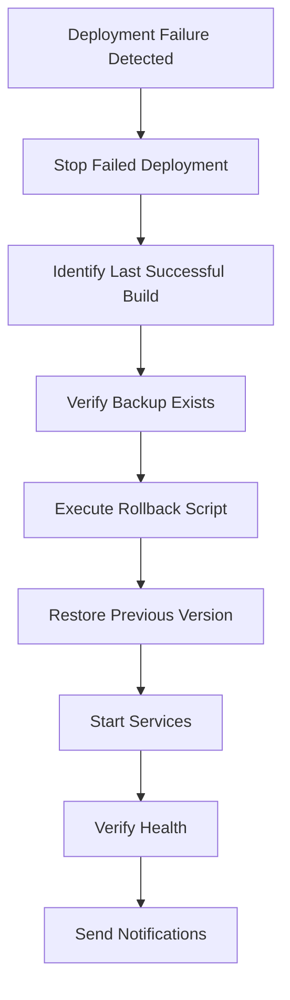

# FarmTally Rollback System Guide

## Overview

The FarmTally rollback system provides comprehensive capabilities for reverting deployments to previous stable versions. This system includes automated rollback triggers, manual rollback procedures, verification processes, and detailed logging.

## System Components

### 1. Rollback Scripts
- **`scripts/rollback-deployment.sh`** - Main rollback execution script
- **`scripts/rollback-verification.js`** - Post-rollback verification and health checks
- **`scripts/failure-handler.js`** - Automatic rollback trigger integration

### 2. Jenkins Integration
- **`jenkins-rollback-job.groovy`** - Parameterized Jenkins job for manual rollbacks
- **Jenkinsfile** - Automatic rollback triggers on deployment failures

### 3. Documentation
- **`docs/rollback-troubleshooting-guide.md`** - Comprehensive troubleshooting procedures
- **`docs/pipeline-failure-handling-guide.md`** - Integration with failure handling system

## Rollback Triggers

### Automatic Rollback Triggers

The system automatically initiates rollback in the following scenarios:

1. **Health Check Failures**
   - Post-deployment health verification fails
   - API endpoints not responding after deployment
   - Service startup failures

2. **Migration Failures**
   - Database migration errors during deployment
   - Schema inconsistencies detected

3. **Critical Service Failures**
   - PM2 process fails to start
   - Application crashes immediately after deployment

### Manual Rollback Triggers

Manual rollback can be initiated through:

1. **Jenkins Rollback Job**
   - Parameterized job with safety confirmations
   - Build number selection and verification
   - Comprehensive logging and reporting

2. **Command Line Interface**
   - Direct script execution on deployment server
   - Emergency rollback procedures
   - Diagnostic and verification commands

## Rollback Procedures

### Automatic Rollback Process

When triggered automatically by the failure handling system:



### Manual Rollback Process

#### Via Jenkins Job

1. **Access Jenkins**
   - Navigate to Jenkins dashboard
   - Select "FarmTally-Rollback" job

2. **Configure Parameters**
   ```
   ROLLBACK_BUILD_NUMBER: [Target build number]
   CONFIRMATION: YES
   SKIP_HEALTH_CHECK: false (recommended)
   BACKUP_CURRENT: true (recommended)
   ```

3. **Execute Rollback**
   - Click "Build with Parameters"
   - Monitor execution in Jenkins console
   - Review completion notifications

#### Via Command Line

```bash
# Set target build number
export ROLLBACK_BUILD_NUMBER=123

# Execute rollback
./scripts/rollback-deployment.sh

# Verify rollback success
./scripts/rollback-verification.js
```

### Emergency Rollback

For critical situations requiring immediate rollback:

```bash
# Quick rollback to last known good build
ssh root@147.93.153.247 "
    cd /opt/farmtally
    LATEST_BACKUP=\$(ls -1 backups/ | grep '^build-' | sort -V | tail -1)
    export ROLLBACK_BUILD_NUMBER=\${LATEST_BACKUP#build-}
    /tmp/rollback-deployment.sh
"
```

## Backup and Artifact Management

### Backup Creation

Backups are automatically created during each deployment:

```bash
# Backup structure
/opt/farmtally/backups/
├── build-123/
│   ├── backend.tar.gz      # Backend application files
│   ├── frontend.tar.gz     # Frontend build artifacts
│   └── manifest.json       # Build metadata
├── build-124/
└── pre-rollback-20241215-143022/  # Pre-rollback snapshots
```

### Backup Verification

Before rollback execution, the system verifies:

- Backup directory exists
- All required files are present (backend.tar.gz, frontend.tar.gz, manifest.json)
- File integrity and accessibility
- Manifest metadata consistency

### Backup Retention

```bash
# Automatic cleanup of old backups (keep last 10 builds)
find /opt/farmtally/backups -name 'build-*' -type d | sort -V | head -n -10 | xargs rm -rf
```

## Verification and Health Checks

### Post-Rollback Verification

The rollback verification system performs comprehensive checks:

#### Critical Checks (Must Pass)
- **PM2 Process Status** - Backend service running
- **API Health Endpoint** - Basic connectivity verification
- **Database Connectivity** - Database access and schema consistency

#### Non-Critical Checks (Warnings Only)
- **Authenticated Endpoints** - Protected route accessibility
- **System Resources** - Memory, disk, and CPU status
- **Application Logs** - Recent error detection
- **Comprehensive Endpoint Testing** - Multiple API endpoint verification

### Health Check Commands

```bash
# Manual health verification
curl http://147.93.153.247:3000/api/health

# Comprehensive verification
node scripts/rollback-verification.js

# PM2 status check
ssh root@147.93.153.247 "pm2 status"

# Application logs
ssh root@147.93.153.247 "pm2 logs farmtally-backend --lines 50"
```

## Database Rollback Considerations

### Current Limitations

The current rollback system has limited database rollback capabilities:

- **Schema Changes**: Manual intervention required for schema rollbacks
- **Data Migration**: No automatic data rollback (by design for data safety)
- **Migration State**: Prisma migration status may need manual verification

### Database Rollback Procedures

#### For Schema Changes
```bash
# Check migration status
npx prisma migrate status

# Manual rollback (if reverse migrations available)
npx prisma migrate resolve --rolled-back <migration-name>

# Reset to clean state (DESTRUCTIVE)
npx prisma migrate reset --force
npx prisma migrate deploy
```

#### For Data Integrity Issues
```bash
# Create immediate backup
pg_dump farmtally > emergency-backup-$(date +%Y%m%d-%H%M%S).sql

# Restore from previous backup (if available)
psql farmtally < backup-file.sql
```

## Monitoring and Alerting

### Rollback Notifications

The system sends notifications for:

- **Successful Rollbacks** - Confirmation with details
- **Failed Rollbacks** - Immediate alerts requiring intervention
- **Health Check Failures** - Post-rollback verification issues

### Notification Channels

```groovy
// Email notifications
emailext (
    subject: "🔄 FarmTally Rollback Status",
    body: "Rollback details...",
    to: "admin@farmtally.in"
)

// Slack notifications (if configured)
slackSend (
    channel: "#deployments",
    message: "Rollback completed for build #123"
)
```

### Monitoring Integration

```bash
# Health monitoring script
#!/bin/bash
while true; do
    if ! curl -f -s http://147.93.153.247:3000/api/health > /dev/null; then
        echo "ALERT: Health check failed - consider rollback"
        # Trigger alert system
    fi
    sleep 60
done
```

## Best Practices

### Rollback Planning

1. **Regular Testing**
   - Test rollback procedures monthly in staging
   - Verify backup integrity weekly
   - Document rollback decision criteria

2. **Communication**
   - Establish clear escalation procedures
   - Maintain updated contact lists
   - Document rollback decision authority

3. **Preparation**
   - Keep rollback procedures easily accessible
   - Maintain emergency access credentials
   - Document known good build numbers

### Rollback Execution

1. **Assessment**
   - Evaluate severity and impact
   - Determine if forward fix is possible
   - Check availability of target backup

2. **Communication**
   - Notify stakeholders of rollback decision
   - Provide estimated completion time
   - Document rollback reasoning

3. **Execution**
   - Follow documented procedures
   - Monitor rollback progress
   - Verify success before declaring completion

4. **Post-Rollback**
   - Conduct thorough verification
   - Document lessons learned
   - Plan forward fix strategy

### Prevention

1. **Deployment Quality**
   - Comprehensive testing before deployment
   - Staged deployment procedures
   - Automated quality gates

2. **Monitoring**
   - Real-time health monitoring
   - Automated alerting systems
   - Performance baseline tracking

3. **Backup Management**
   - Regular backup verification
   - Automated backup creation
   - Backup retention policies

## Troubleshooting

### Common Issues

1. **Backup Not Found**
   - Check backup directory permissions
   - Verify backup creation process
   - Use alternative backup if available

2. **Service Start Failures**
   - Check PM2 configuration
   - Verify environment variables
   - Review application logs

3. **Health Check Failures**
   - Allow additional startup time
   - Check external dependencies
   - Verify network connectivity

4. **Database Issues**
   - Check migration status
   - Verify database connectivity
   - Review schema consistency

### Emergency Procedures

For complete system failure:

1. **Immediate Response**
   ```bash
   # Stop all services
   ssh root@147.93.153.247 "pm2 delete all"
   
   # Deploy maintenance page
   # (Implementation depends on your setup)
   ```

2. **System Recovery**
   ```bash
   # Clean deployment
   ssh root@147.93.153.247 "rm -rf /opt/farmtally/backend /opt/farmtally/frontend"
   
   # Restore from backup
   ssh root@147.93.153.247 "
       cd /opt/farmtally
       LATEST_BACKUP=\$(ls -1 backups/ | grep '^build-' | sort -V | tail -1)
       tar -xzf backups/\$LATEST_BACKUP/backend.tar.gz
       tar -xzf backups/\$LATEST_BACKUP/frontend.tar.gz
   "
   
   # Restart services
   ssh root@147.93.153.247 "
       cd /opt/farmtally/backend
       npm ci --only=production
       pm2 start server.js --name farmtally-backend
   "
   ```

## Integration with CI/CD Pipeline

### Automatic Integration

The rollback system integrates with the Jenkins pipeline through:

- **Failure Detection** - Automatic triggers on deployment failures
- **Health Verification** - Post-deployment health checks
- **Notification System** - Integrated alerting and reporting

### Manual Integration

Manual rollback procedures are available through:

- **Jenkins Jobs** - Parameterized rollback execution
- **Command Line** - Direct script execution
- **Emergency Procedures** - Rapid response capabilities

This comprehensive rollback system ensures that FarmTally deployments can be quickly and safely reverted when issues occur, maintaining service availability and data integrity.