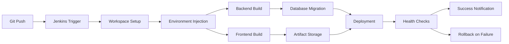
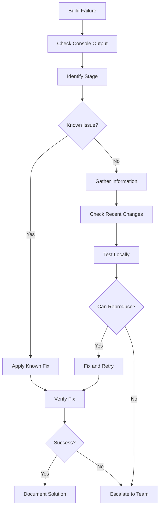
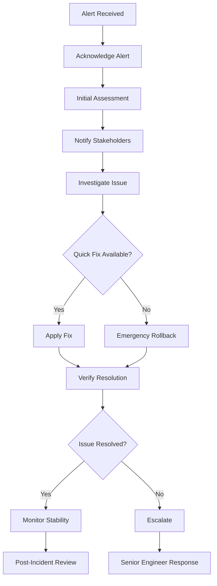

# Team Training Materials - Pipeline Operations

## Overview

This document provides comprehensive training materials for team members who will be operating, maintaining, and troubleshooting the FarmTally Jenkins CI/CD pipeline. It includes learning objectives, hands-on exercises, assessment criteria, and ongoing training requirements.

## Training Program Structure

### Learning Tracks

#### Track 1: Pipeline Operators (All Developers)
- **Duration**: 4 hours
- **Prerequisites**: Basic Git and command line knowledge
- **Audience**: All development team members
- **Certification**: Pipeline Operator Certificate

#### Track 2: Pipeline Administrators (DevOps/Senior Developers)
- **Duration**: 8 hours
- **Prerequisites**: Track 1 completion + Jenkins experience
- **Audience**: DevOps engineers, senior developers
- **Certification**: Pipeline Administrator Certificate

#### Track 3: Incident Responders (On-call Engineers)
- **Duration**: 6 hours
- **Prerequisites**: Track 1 completion
- **Audience**: On-call rotation members
- **Certification**: Incident Response Certificate

## Track 1: Pipeline Operators

### Module 1.1: Pipeline Overview (30 minutes)

#### Learning Objectives
- Understand FarmTally pipeline architecture
- Identify pipeline stages and their purposes
- Recognize normal vs. abnormal pipeline behavior

#### Content

**Pipeline Architecture**


**Pipeline Stages Explained**
1. **Workspace Setup**: Validates repository structure and paths
2. **Environment Injection**: Loads secure credentials from Jenkins vault
3. **Backend Build**: Compiles TypeScript and creates production bundle
4. **Frontend Build**: Builds Next.js application with production configuration
5. **Database Migration**: Applies Prisma schema changes
6. **Deployment**: Uploads artifacts and restarts services
7. **Health Checks**: Verifies application functionality
8. **Artifact Storage**: Archives build for rollback capability

#### Hands-on Exercise 1.1
```bash
# Exercise: Explore Pipeline Structure
1. Access Jenkins dashboard
2. Navigate to FarmTally-Pipeline job
3. Review last 5 builds and their stages
4. Identify which stages took longest
5. Note any failed builds and their failure points

# Questions to answer:
- What is the average build duration?
- Which stage fails most frequently?
- How can you tell if a build was successful?
```

### Module 1.2: Triggering and Monitoring Builds (45 minutes)

#### Learning Objectives
- Trigger manual builds safely
- Monitor build progress and identify issues
- Understand build logs and console output
- Use Jenkins dashboard effectively

#### Content

**Manual Build Triggers**
```bash
# Safe build triggering checklist:
1. Verify no other builds are running
2. Check if deployment window is appropriate
3. Ensure you have rollback capability
4. Notify team of manual deployment
5. Monitor build progress actively
```

**Build Monitoring Best Practices**
- Always watch console output during manual builds
- Check each stage completion before moving to next
- Monitor system resources during builds
- Verify health checks pass before considering success

**Reading Build Logs**
```bash
# Key log sections to monitor:
1. Environment variable injection
2. Dependency installation output
3. Build compilation messages
4. Test execution results
5. Deployment status messages
6. Health check responses
```

#### Hands-on Exercise 1.2
```bash
# Exercise: Trigger and Monitor a Build
1. Navigate to Jenkins FarmTally-Pipeline
2. Click "Build with Parameters"
3. Select appropriate branch (staging/main)
4. Monitor console output in real-time
5. Identify each stage transition
6. Note any warnings or errors
7. Verify successful completion

# Assessment Questions:
- How long did each stage take?
- Were there any warnings in the logs?
- Did all health checks pass?
- What would you do if a stage failed?
```

### Module 1.3: Understanding Build Failures (60 minutes)

#### Learning Objectives
- Identify common failure patterns
- Read and interpret error messages
- Know when to escalate vs. retry
- Understand rollback indicators

#### Content

**Common Failure Types**

1. **Environment Issues**
   ```bash
   # Symptoms:
   - Missing environment variables
   - Database connection failures
   - External service timeouts
   
   # Actions:
   - Check Jenkins credentials configuration
   - Verify service availability
   - Contact DevOps team if persistent
   ```

2. **Build Compilation Errors**
   ```bash
   # Symptoms:
   - TypeScript compilation errors
   - Missing dependencies
   - Syntax errors in code
   
   # Actions:
   - Review recent code changes
   - Check package.json modifications
   - Coordinate with code author
   ```

3. **Test Failures**
   ```bash
   # Symptoms:
   - Unit test failures
   - Integration test timeouts
   - Coverage threshold not met
   
   # Actions:
   - Review test output details
   - Check if tests pass locally
   - Investigate test environment differences
   ```

4. **Deployment Failures**
   ```bash
   # Symptoms:
   - File upload errors
   - Service restart failures
   - Health check failures
   
   # Actions:
   - Check server connectivity
   - Verify disk space and resources
   - Escalate to DevOps immediately
   ```

#### Hands-on Exercise 1.3
```bash
# Exercise: Analyze Failed Builds
1. Find a recent failed build in Jenkins
2. Open console output
3. Identify the failure point
4. Categorize the failure type
5. Determine appropriate response action
6. Document findings

# Practice Scenarios:
- Build fails due to missing environment variable
- Frontend build fails due to TypeScript error
- Deployment fails due to health check timeout
- Database migration fails due to schema conflict
```

### Module 1.4: Basic Troubleshooting (45 minutes)

#### Learning Objectives
- Perform initial troubleshooting steps
- Know escalation procedures
- Use available diagnostic tools
- Document issues properly

#### Content

**Troubleshooting Workflow**


**Diagnostic Commands**
```bash
# Check application status
curl -f https://farmtally.com/api/health

# Check server resources
ssh farmtally@prod-server "df -h && free -m && pm2 status"

# Check recent deployments
# Review Jenkins build history

# Check database connectivity
ssh farmtally@prod-server "psql farmtally_production -c 'SELECT 1;'"

# Check application logs
ssh farmtally@prod-server "pm2 logs farmtally --lines 50"
```

#### Hands-on Exercise 1.4
```bash
# Exercise: Troubleshooting Simulation
1. Instructor will simulate common issues
2. Use troubleshooting workflow to diagnose
3. Apply appropriate fixes
4. Document the resolution process
5. Present findings to group

# Simulated Issues:
- Environment variable missing
- Database connection timeout
- Frontend API endpoint misconfiguration
- Health check endpoint returning 500
```

## Track 2: Pipeline Administrators

### Module 2.1: Jenkins Configuration Management (90 minutes)

#### Learning Objectives
- Manage Jenkins credentials securely
- Configure pipeline parameters
- Update Jenkinsfile safely
- Manage plugin dependencies

#### Content

**Credential Management**
```bash
# Adding new credentials:
1. Navigate to Manage Jenkins > Manage Credentials
2. Select appropriate domain (Global/System)
3. Add credential with descriptive ID
4. Test credential in pipeline
5. Update documentation

# Credential types:
- Secret text: API keys, tokens
- Username/password: Database credentials
- SSH keys: Server access
- Certificate: SSL certificates
```

**Pipeline Configuration**
```groovy
// Jenkinsfile parameter configuration
parameters {
    choice(
        name: 'ENVIRONMENT',
        choices: ['staging', 'production'],
        description: 'Target deployment environment'
    )
    booleanParam(
        name: 'SKIP_TESTS',
        defaultValue: false,
        description: 'Skip test execution (emergency deployments only)'
    )
    string(
        name: 'GIT_BRANCH',
        defaultValue: 'main',
        description: 'Git branch to deploy'
    )
}
```

#### Hands-on Exercise 2.1
```bash
# Exercise: Credential Management
1. Add a new test credential to Jenkins
2. Update Jenkinsfile to use the credential
3. Test the credential in a build
4. Remove the test credential
5. Document the process

# Exercise: Pipeline Parameters
1. Add a new parameter to the pipeline
2. Use the parameter in a pipeline stage
3. Test with different parameter values
4. Update pipeline documentation
```

### Module 2.2: Advanced Monitoring and Alerting (90 minutes)

#### Learning Objectives
- Configure custom metrics collection
- Set up advanced alert rules
- Create custom dashboards
- Implement automated responses

#### Content

**Custom Metrics Implementation**
```javascript
// Application metrics example
const prometheus = require('prom-client');

const buildDuration = new prometheus.Histogram({
    name: 'jenkins_build_duration_custom',
    help: 'Custom build duration tracking',
    labelNames: ['stage', 'environment', 'success']
});

// Usage in pipeline
buildDuration.labels('build', 'production', 'true').observe(duration);
```

**Advanced Alert Rules**
```yaml
# Complex alert rule example
- alert: PipelinePerformanceDegradation
  expr: |
    (
      avg_over_time(jenkins_builds_duration_milliseconds_summary[7d]) -
      avg_over_time(jenkins_builds_duration_milliseconds_summary[7d] offset 7d)
    ) / avg_over_time(jenkins_builds_duration_milliseconds_summary[7d] offset 7d) > 0.2
  for: 1h
  labels:
    severity: medium
    team: devops
  annotations:
    summary: "Pipeline performance has degraded"
    description: "Build duration increased by {{ $value | humanizePercentage }} over last week"
```

#### Hands-on Exercise 2.2
```bash
# Exercise: Custom Dashboard Creation
1. Create a new Grafana dashboard
2. Add panels for custom metrics
3. Configure alert thresholds
4. Test alert firing conditions
5. Share dashboard with team

# Exercise: Alert Rule Development
1. Identify a new metric to monitor
2. Write Prometheus alert rule
3. Test alert rule in staging
4. Deploy to production monitoring
5. Document alert response procedure
```

### Module 2.3: Pipeline Security and Compliance (60 minutes)

#### Learning Objectives
- Implement security best practices
- Manage access controls
- Audit pipeline activities
- Ensure compliance requirements

#### Content

**Security Best Practices**
```bash
# Credential security:
1. Use Jenkins credential store exclusively
2. Rotate credentials regularly
3. Implement least-privilege access
4. Audit credential usage
5. Monitor for credential exposure

# Pipeline security:
1. Validate all inputs
2. Sanitize environment variables
3. Implement approval gates for production
4. Log all pipeline activities
5. Regular security reviews
```

**Access Control Configuration**
```groovy
// Role-based access example
pipeline {
    agent any
    
    options {
        // Require approval for production deployments
        timeout(time: 1, unit: 'HOURS')
    }
    
    stages {
        stage('Production Approval') {
            when {
                branch 'main'
            }
            steps {
                input message: 'Deploy to production?', 
                      submitter: 'admin,devops-team'
            }
        }
    }
}
```

#### Hands-on Exercise 2.3
```bash
# Exercise: Security Audit
1. Review current credential usage
2. Identify potential security risks
3. Implement additional security measures
4. Document security procedures
5. Create security checklist

# Exercise: Compliance Implementation
1. Implement deployment approval process
2. Add audit logging to pipeline
3. Create compliance report
4. Test approval workflow
5. Document compliance procedures
```

## Track 3: Incident Responders

### Module 3.1: Incident Response Procedures (90 minutes)

#### Learning Objectives
- Follow incident response workflow
- Communicate effectively during incidents
- Perform emergency rollbacks
- Document incident details

#### Content

**Incident Response Workflow**


**Emergency Rollback Procedures**
```bash
# Automated rollback via Jenkins
1. Navigate to Jenkins Rollback job
2. Select target version (last known good)
3. Confirm rollback parameters
4. Execute rollback job
5. Monitor rollback progress
6. Verify system stability

# Manual rollback commands
ssh farmtally@prod-server
pm2 stop farmtally
cp -r /opt/farmtally/previous/* /opt/farmtally/current/
pm2 start farmtally
curl -f https://farmtally.com/api/health
```

#### Hands-on Exercise 3.1
```bash
# Exercise: Incident Simulation
1. Instructor triggers simulated incident
2. Follow incident response workflow
3. Communicate status updates
4. Perform appropriate remediation
5. Document incident timeline
6. Conduct post-incident review

# Scenarios:
- Production deployment failure
- Database connectivity issues
- High error rate alert
- Performance degradation
```

### Module 3.2: Advanced Troubleshooting (90 minutes)

#### Learning Objectives
- Perform deep system analysis
- Use advanced diagnostic tools
- Coordinate with external teams
- Make critical decisions under pressure

#### Content

**Advanced Diagnostic Techniques**
```bash
# System-level diagnostics
# Check system resources
top -p $(pgrep -f farmtally)
iostat -x 1 5
netstat -tulpn | grep :3000

# Application-level diagnostics
# Check application metrics
curl -s http://localhost:3000/api/metrics | grep error_rate
pm2 monit
tail -f /var/log/farmtally/application.log

# Database diagnostics
psql farmtally_production -c "
SELECT 
    pid, 
    now() - pg_stat_activity.query_start AS duration, 
    query 
FROM pg_stat_activity 
WHERE (now() - pg_stat_activity.query_start) > interval '5 minutes';
"
```

**Decision Making Framework**
```bash
# Critical decision points:
1. When to rollback vs. fix forward
2. When to scale resources vs. optimize code
3. When to take system offline vs. degrade gracefully
4. When to escalate vs. continue troubleshooting

# Decision criteria:
- Impact on users
- Time to resolution
- Risk of making things worse
- Available resources and expertise
```

#### Hands-on Exercise 3.2
```bash
# Exercise: Complex Troubleshooting
1. Multi-layered issue simulation
2. Use advanced diagnostic tools
3. Coordinate with multiple team members
4. Make critical decisions
5. Document troubleshooting process
6. Present solution to stakeholders

# Complex scenarios:
- Cascading failure across multiple services
- Performance issue with unclear root cause
- Security incident during deployment
- Data corruption during migration
```

## Assessment and Certification

### Track 1 Assessment: Pipeline Operator Certification

#### Practical Assessment (60 minutes)
```bash
# Task 1: Build Monitoring (15 minutes)
- Trigger a manual build
- Monitor progress and identify any issues
- Document build timeline and results

# Task 2: Failure Analysis (20 minutes)
- Analyze provided failed build logs
- Identify root cause
- Recommend appropriate action

# Task 3: Basic Troubleshooting (25 minutes)
- Diagnose simulated pipeline issue
- Apply appropriate troubleshooting steps
- Document resolution process
```

#### Written Assessment (30 minutes)
- Pipeline architecture understanding
- Build failure categorization
- Escalation procedures
- Safety protocols

#### Certification Requirements
- Score 80% or higher on practical assessment
- Score 85% or higher on written assessment
- Complete all hands-on exercises
- Demonstrate safe pipeline operation

### Track 2 Assessment: Pipeline Administrator Certification

#### Advanced Practical Assessment (90 minutes)
```bash
# Task 1: Configuration Management (30 minutes)
- Add new environment configuration
- Update Jenkinsfile with new feature
- Test configuration changes

# Task 2: Monitoring Setup (30 minutes)
- Create custom dashboard
- Configure new alert rule
- Test alert functionality

# Task 3: Security Implementation (30 minutes)
- Implement new security control
- Audit existing configurations
- Document security procedures
```

#### Technical Interview (45 minutes)
- Advanced Jenkins concepts
- Security best practices
- Performance optimization
- Compliance requirements

#### Certification Requirements
- Score 85% or higher on practical assessment
- Pass technical interview
- Complete advanced exercises
- Demonstrate leadership in pipeline operations

### Track 3 Assessment: Incident Response Certification

#### Incident Simulation Assessment (120 minutes)
```bash
# Scenario 1: Production Outage (45 minutes)
- Respond to critical production alert
- Coordinate incident response
- Implement resolution
- Communicate with stakeholders

# Scenario 2: Performance Degradation (45 minutes)
- Investigate performance issues
- Identify root cause
- Implement optimization
- Monitor improvement

# Scenario 3: Security Incident (30 minutes)
- Respond to security alert
- Assess impact and risk
- Implement containment
- Coordinate with security team
```

#### Incident Response Interview (30 minutes)
- Decision making under pressure
- Communication skills
- Technical troubleshooting
- Post-incident procedures

#### Certification Requirements
- Successfully resolve all incident scenarios
- Demonstrate effective communication
- Show appropriate decision making
- Complete incident documentation

## Ongoing Training and Development

### Monthly Training Sessions (2 hours)

#### Session Topics Rotation
- **Month 1**: New pipeline features and updates
- **Month 2**: Incident response case studies
- **Month 3**: Performance optimization techniques
- **Month 4**: Security updates and best practices
- **Month 5**: Advanced monitoring and alerting
- **Month 6**: Disaster recovery procedures

#### Session Format
```bash
# Standard session structure:
1. Review of recent incidents (30 minutes)
2. New feature/technique presentation (45 minutes)
3. Hands-on practice (30 minutes)
4. Q&A and discussion (15 minutes)
```

### Quarterly Assessments

#### Skills Validation
- Practical skills demonstration
- Knowledge update verification
- New feature competency
- Safety protocol adherence

#### Certification Renewal
- Annual recertification required
- Continuing education credits
- Peer review participation
- Incident response performance

### Knowledge Sharing

#### Documentation Contributions
- Update runbooks based on experience
- Share troubleshooting discoveries
- Document new procedures
- Create training materials

#### Mentorship Program
- Experienced operators mentor newcomers
- Cross-training between teams
- Knowledge transfer sessions
- Best practice sharing

### Performance Metrics

#### Individual Metrics
- Incident response time
- Resolution success rate
- Safety protocol adherence
- Knowledge sharing contributions

#### Team Metrics
- Overall system reliability
- Deployment success rate
- Mean time to resolution
- Training completion rates

## Resources and References

### Documentation Links
- [Jenkins Pipeline Operation Guide](jenkins-pipeline-operation-guide.md)
- [Troubleshooting Guide](jenkins-pipeline-troubleshooting-guide.md)
- [Alert Response Procedures](alert-configuration-response-procedures.md)
- [Backup and Recovery Procedures](backup-disaster-recovery-procedures.md)

### External Resources
- Jenkins Official Documentation
- Prometheus Monitoring Guide
- Grafana Dashboard Creation
- Incident Response Best Practices

### Contact Information
- **Pipeline Team Lead**: pipeline-lead@farmtally.com
- **DevOps Team**: devops@farmtally.com
- **On-call Support**: oncall@farmtally.com
- **Training Coordinator**: training@farmtally.com

This comprehensive training program ensures all team members have the knowledge and skills necessary to operate the FarmTally Jenkins pipeline safely and effectively.